<p align="center">
    
</p>
<h1 align="center">Xi-API 接口开放平台</h1>
<p align="center"><strong>Xi-API 接口开放平台是一个为用户和开发者提供全面API接口调用服务的平台 🛠</strong></p>


## 项目介绍 🙋

**😀 作为用户您可以通过注册登录账户，获取接口调用权限，并根据自己的需求浏览和选择适合的接口。您可以在线进行接口调试，快速验证接口的功能和效果。**

**💻 作为开发者 我们提供了[客户端SDK: Xi-API-SDK](https://github.com/xiweicoder/api)，
通过开发者凭证即可将轻松集成接口到您的项目中，实现更高效的开发和调用。**

**🤝 您可以将自己的接口接入到Xi-API 接口开放平台平台上，并发布给其他用户使用。 您可以管理和各个接口，以便更好地分析和优化接口性能。**

**👌 还提供了开发者在线文档和技术支持，帮助您快速接入和发布接口。**

**🏁 无论您是用户还是开发者，Xi-API 接口开放平台都致力于提供稳定、安全、高效的接口调用服务，帮助您实现更快速、便捷的开发和调用体验。**

## 目录结构 📑

| 目录                                                     | 描述               |
|--------------------------------------------------------| ------------------ |
| **🏘️ [qi-api-backend](./qi-api-backend)**             | Qi-API后端服务模块 |
| **🏘️ [qi-api-common](./qi-api-common)**               | 公共服务模块       |
| **🕸️ [qi-api-gateway](./qi-api-gateway)**             | 网关模块           |
| **🔗 [qi-api-interface](./qi-api-interface)**          | 接口模块           |
| **🛠 [qi-qpi-sdk](https://github.com/xiweicoder/api)** | 开发者调用sdk      |
| **📘 [qi-api-doc](https://doc.qimuu.icu/)**            | 接口在线文档       |
## 快速启动 🚀

### 前端

环境要求：Node.js >= 16

安装依赖：

```bash
yarn or  npm install
```

启动：

```bash
yarn run dev or npm run start:dev
```

部署：

```bash
yarn build or npm run build
```

### 后端

执行sql目录下ddl.sql

## 网站导航 🧭

- **[Xi-API-SDK](https://github.com/xiweicoder/api)** 🛠

- **[Xi-API 接口开放平台 🔗](https://api.Ximuu.icu/)**

- **[Xi-API-DOC 开发者文档 📖](https://doc.Ximuu.icu/)**
- **[Xi-API-SDK-demo ✔️](https://github.com/xiweicoder/api-demo/blob/master/src/main/java/icu/Ximuu/Xiapisdkdemo/controller/InvokeController.java)**

## 项目选型 🎯

### **后端**

- Spring Boot 2.7.0
- Spring MVC
- MySQL8 数据库
- 阿里云OSS存储
- Dubbo 分布式（RPC、Nacos）
- Spring Cloud Gateway 微服务网关
- API 签名认证（Http 调用）
- Swagger + Knife4j 接口文档
- Spring Boot Starter（SDK 开发）
- Apache Commons Lang3 工具类
- MyBatis-Plus 及 MyBatis X 自动生成
- Hutool、Apache Common Utils、Gson 等工具库

### 前端

- React 18

- Ant Design Pro 5.x 脚手架

- Ant Design & Procomponents 组件库

- Umi 4 前端框架

- OpenAPI 前端代码生成

## 功能介绍 📋

`金币`即积分，用于平台接口调用。

|                          **功能**                           | 游客 | **普通用户** | **管理员** |
| ----------------------------------------------------- |--------------|-----|-----|
| [**Xi-API-SDK**](https://github.com/xiweicoder/api)使用 | ✅ | ✅ |     ✅      |
|        **[开发者API在线文档](https://github.com/xiweicoder/api)**        | ✅ | ✅ |     ✅      |
|                     邀请好友注册得金币                      | ❌ | ✅ |     ✅      |
|                    切换主题、深色、暗色                     | ✅ | ✅ | ✅ |
|                        在线调试接口                         | ❌ | ✅ | ✅ |
|                       每日签到得金币                        | ❌ | ✅ | ✅ |
|                 接口大厅搜索接口、浏览接口                  | ✅ | ❌ | ✅ |
|                          更新头像                           | ❌ | ✅ | ✅ |
|                    绑定、换绑、解绑邮箱                     | ❌ | ✅ | ✅ |
|                    商品管理、上线、下架                     | ❌ | ❌ |✅|
|                    用户管理、封号解封等                     | ❌ | ❌ | ✅ |
|                接口管理、接口发布审核、下架                 | ❌ | ❌ | ✅ |
| AI聊天 | ❌ | ❌ | ✅ |

## 功能展示 ✨

### 首页

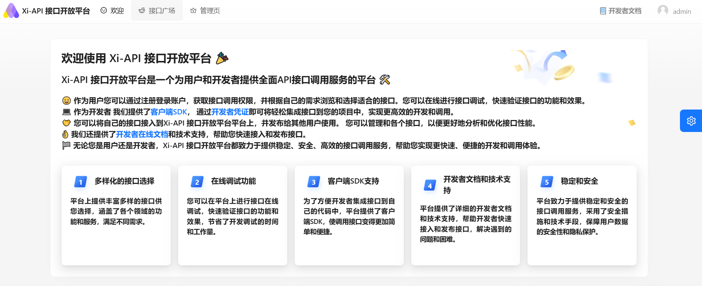

### 接口广场

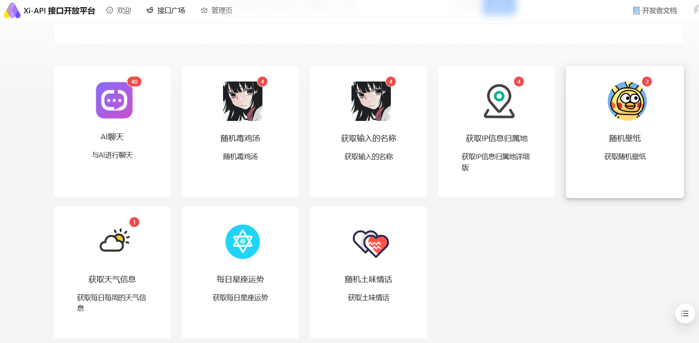

### 接口描述

#### **在线API**

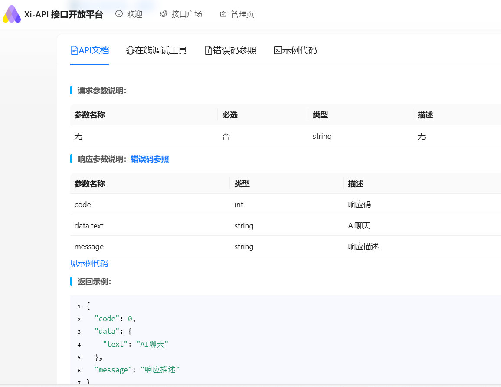

#### 在线调试工具

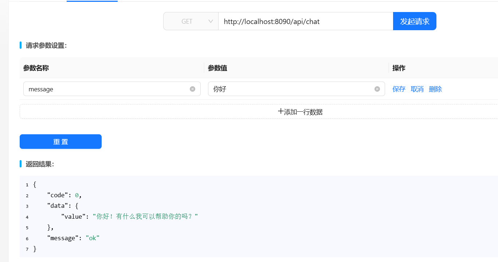

#### **错误码参考**

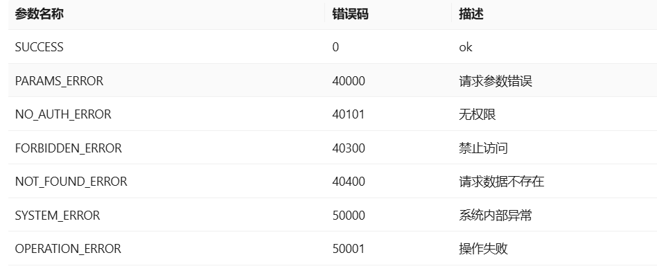

#### **接口调用代码示例**

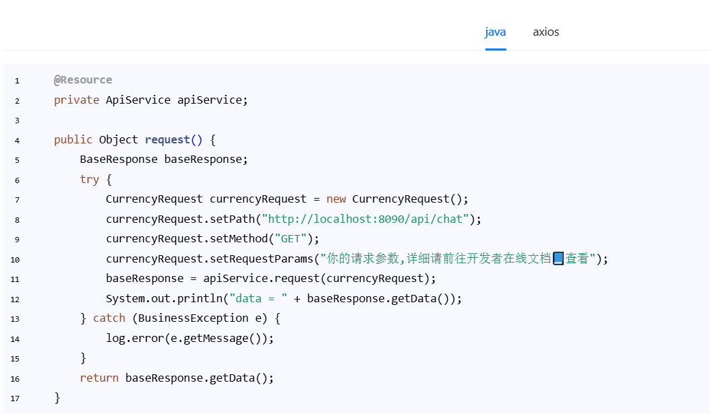

#### 用户管理

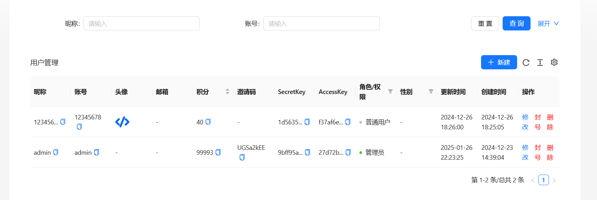

#### 接口管理

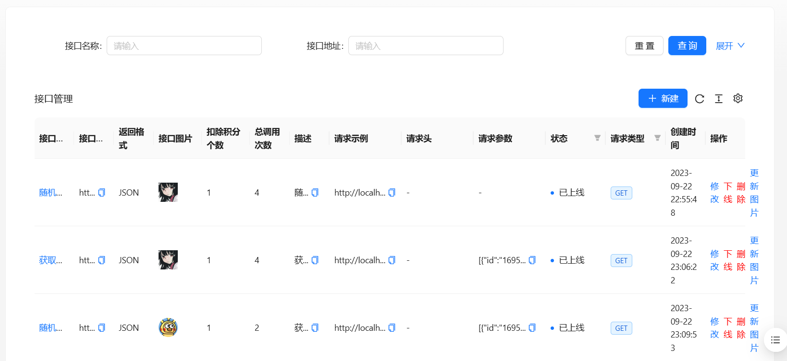

### 个人信息

#### 信息展示

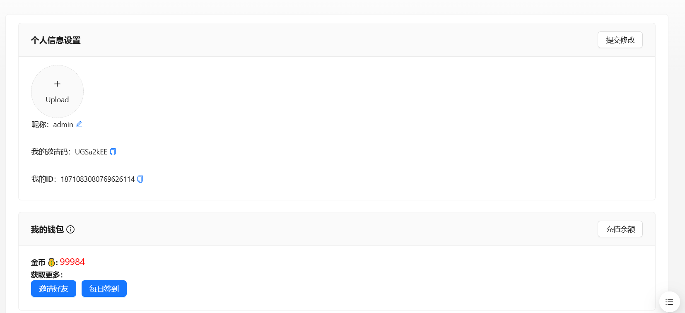

#### 每日签到

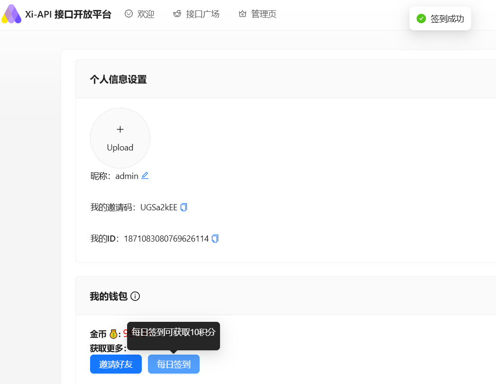

### 登录/注册

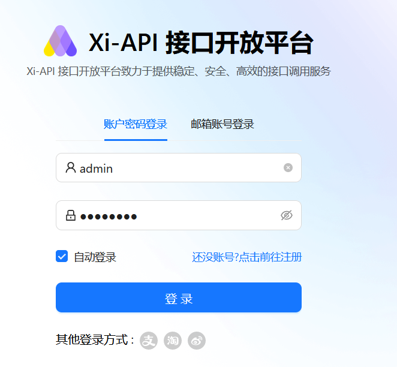

### 主题切换

#### 深色主题

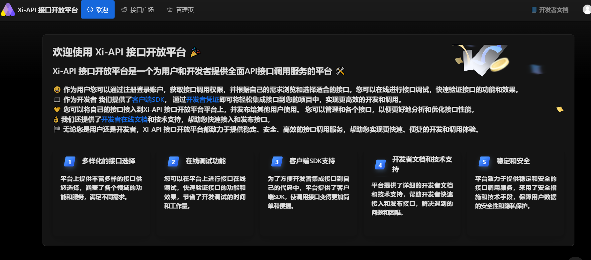

#### 浅色主题

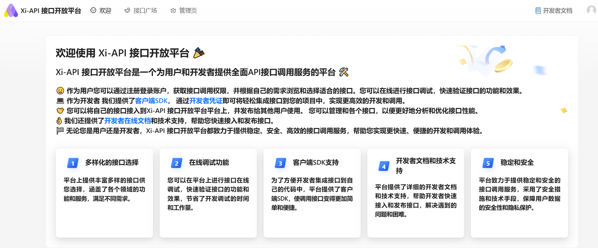